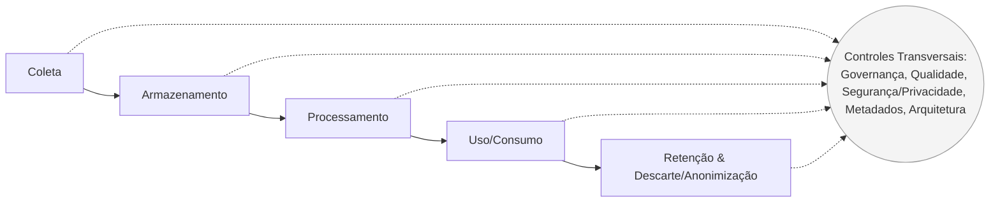
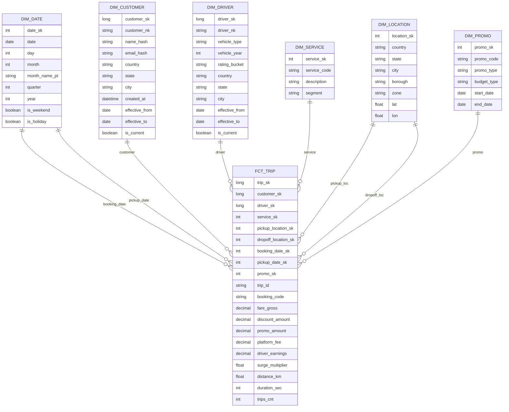

# Exercício 1 — Autoavaliação de Maturidade Organizacional (DMBOK)  
**Estudo de caso (público): Uber**

## Objetivo
Permitir que os participantes avaliem o nível de maturidade de gestão de dados em suas organizações.

## Instruções
Para cada domínio do DMBOK, avalie a organização numa escala de **1 a 5** (*1 = Inexistente/Ad hoc* … *5 = Otimizado*). Em seguida, gere um **gráfico radar** mostrando o perfil de maturidade.

## Domínios (DMBOK)
**Governança, Arquitetura, Modelagem, Armazenamento, Segurança, Integração, Documentos, Master Data, DW/BI, Metadados, Qualidade**

---

## Avaliação estimada (Uber)
> **Aviso**: pontuações estimadas com base em materiais públicos (blog de engenharia, repositórios open-source, talks). Não é um “score oficial” da empresa.

| Domínio | Nota (1–5) | Justificativa resumida |
|---|:--:|---|
| Governança | **4** | Controles de acesso maduros, privacidade e conformidade fortalecidas em escala. |
| Arquitetura | **5** | Arquitetura moderna de dados (*lakehouse*), processamento incremental e escalável. |
| Modelagem | **4** | Gestão de esquemas e padronização (registries/formatos) amplamente adotadas. |
| Armazenamento | **5** | Data lake transacional (uso destacado de tecnologias como Apache Hudi). |
| Segurança | **4** | ABAC, gestão de segredos e *hardening* contínuo. |
| Integração | **5** | Ingestão e pipelines genéricos em grande escala (p.ex., Marmaray). |
| Documentos | **2** | Pouca evidência pública de um programa corporativo de gestão de documentos alinhado ao DMBOK. |
| Master Data | **3** | Capacidades de identidade/unificação robustas; indícios limitados de MDM corporativo formal público. |
| DW/BI | **4** | Analytics em tempo real e *dashboards* operacionais (p.ex., Pinot). |
| Metadados | **5** | Catálogo/portal de dados corporativo (p.ex., Databook) com forte adoção. |
| Qualidade | **5** | Plataforma e práticas de Qualidade de Dados integradas aos fluxos de engenharia. |

---

## Gráfico radar (imagem)


---

# Exercício 2 — Mapeamento do Ciclo de Vida dos Dados (DMBOK)
**Estudo de caso (público): Uber (plataforma de mobilidade/entregas; análogo a e‑commerce de serviços)**

## Objetivo
Aplicar o conceito de **ciclo de vida dos dados** do DMBOK a um cenário real, descrevendo **atividades, tecnologias, desafios, KPIs e melhorias** em cada fase.

## Cenário
A Uber coleta e usa dados de **clientes**, **parceiros (motoristas/entregadores)**, **serviços/ofertas** e **transações** (corridas/entregas, pagamentos). Há também **telemetria** (localização, eventos de app) e **metadados** (esquemas, donos, sensibilidade).

### Escopo de dados (exemplos)
- **Clientes:** cadastro, consentimentos, preferências, tokens de pagamento.
- **Parceiros:** documentos, habilitações, score de qualidade/risco.
- **Serviços/ofertas:** tipos de corrida/entrega, tarifas, promoções.
- **Transações:** pedidos, matching, eventos de viagem, antifraude, pagamentos/reembolsos.
- **Telemetria:** localização, logs de app/backend, métricas de performance.
- **Metadados:** esquemas, linhagem, donos, classificação de sensibilidade e prazos de retenção.

---

## Visão geral do fluxo


> Fases: **Coleta → Armazenamento → Processamento → Uso/Consumo → Retenção & Descarte/Anonimização**.  
> Controles transversais DMBOK: **Governança, Qualidade, Segurança/Privacidade, Metadados, Arquitetura**.

---

## 1) Coleta
**Objetivo:** adquirir dados com confiabilidade, segurança e consentimento.

**Atividades**
- Instrumentação *event-first* nos apps (mobile/web) e serviços de backend.
- APIs de cadastro/login/pedidos/pagamentos; webhooks de parceiros (antifraude, gateways).
- **Consent management**: captura/versionamento de propósitos (marketing, analytics, segurança).
- Validação de esquema e **tagueamento de PII** na entrada; deduplicação básica.

**Tecnologias (exemplos)**
- **Streaming/Filas:** Kafka/PubSub · **CDC/ETL:** Debezium, Fivetran, Confluent.
- **APIs:** REST/gRPC · **Observabilidade:** OpenTelemetry.
- **Esquemas/Contratos:** Avro/Protobuf/JSON Schema + *schema registry*.

**Qualidade & Governança**
- *Data contracts* de eventos com dono e versionamento; validação online.
- Catálogo de campos com **sensibilidade** (PII/PCI), **propósito** e **retenção**.

**KPIs sugeridos**
- % de eventos válidos vs. rejeitados; latência p95 de ingestão; cobertura de consentimento; % de eventos com `schemaId` válido.

**Riscos/Desafios & Mitigações**
- **Quebra de esquema:** compatibilidade retroativa obrigatória + *canary* + bloqueio de deploy.
- **Coleta excessiva de PII:** *privacy by design* (minimização, *purpose limitation*).

**Melhorias recomendadas**
- SDKs padronizados de eventos por linguagem; *feature flags* para isolar fontes problemáticas.

---

## 2) Armazenamento
**Objetivo:** persistir dados com custo/desempenho/segurança adequados.

**Atividades**
- *Landing* (raw) → **camadas** bronze/silver/gold (*lakehouse*).
- Criptografia em repouso; segregação por sensibilidade; tokenização (PCI).
- Particionamento temporal; compactação e *clustering*.

**Tecnologias (exemplos)**
- **Data Lake/Lakehouse:** Apache Hudi/Delta/Iceberg sobre S3/GCS.
- **Formats:** Parquet/ORC · **Warehouse/Query:** BigQuery/Snowflake/Trino.
- **Catálogo:** Hive/Glue + portal de metadados (ex.: Databook).

**Qualidade & Governança**
- *Access control* (RBAC/ABAC) por domínio/sensibilidade; *row/column-level security*.
- Checagens automáticas de **completude**, **unicidade** e **freshness** na ingestão.

**KPIs sugeridos**
- Custo por TB/mês; SLA de disponibilidade; taxa de *late data*; número de pequenos arquivos (*small files*).

**Riscos/Desafios & Mitigações**
- **Skew e pequenos arquivos:** *compaction* e *clustering* automáticos.
- **Hot partitions:** *bucketing* e particionamento adaptativo.

**Melhorias recomendadas**
- Catálogo com *business glossary* e **classificação automática de PII** por *scanners*.

---

## 3) Processamento
**Objetivo:** transformar e preparar dados para consumo analítico/operacional/ML.

**Atividades**
- ETL/ELT **incremental** (upsert/merge-on-read); tratamento de *late-arriving data*.
- Deduplicação; *slowly changing dimensions*; *backfills* reproduzíveis.
- **Feature Store** (on/offline) para modelos; agregações em tempo real para monitoração.

**Tecnologias (exemplos)**
- **Engines:** Spark/Flink/Beam · **Orquestração:** Airflow/Argo.
- **Realtime analytics:** Pinot/Druid/ClickHouse.
- **Feature Store:** Feast/Tecton · **ML Ops:** MLflow.

**Qualidade & Governança**
- *Unit tests* e *expectations* (Great Expectations/Deequ); *data contracts* entre camadas.
- Linhagem ponta a ponta no catálogo (job → tabela → dashboard).

**KPIs sugeridos**
- Latência fim-a-fim (evento → dataset pronto); taxa de *failed jobs*; % de SLO cumprido.

**Riscos/Desafios & Mitigações**
- **Alterações upstream quebrando jobs:** contratos + *canary pipelines* e *schema evolution* controlada.
- **Custo de shuffle/scan:** bom particionamento, *predicate pushdown*, *caching*.

**Melhorias recomendadas**
- *Time travel* e versionamento de dados (Hudi/Delta/Iceberg) para auditoria e reprocessamento.

---

## 4) Uso / Consumo
**Objetivo:** entregar dados com **self-service responsável** para Analytics, Operações e ML.

**Atividades**
- *Dashboards* operacionais e de negócio; **plataforma de experimentação** (A/B). 
- Produtos de dados e **APIs** estáveis para áreas parceiras.
- *Model serving* para precificação dinâmica, ETA, matching e antifraude.

**Tecnologias (exemplos)**
- **BI:** Looker/Tableau/Metabase · **Serving:** APIs REST/gRPC, Redis/Feast online.
- **Experimentação:** plataforma de testes A/B · **Notebooks:** Jupyter.

**Qualidade & Governança**
- Selo **gold/certified** para conjuntos confiáveis; *semantic layer* com métricas versionadas.
- Publicação de **SLAs/SLOs** de dados; *access reviews* periódicos.

**KPIs sugeridos**
- Adoção (MAU de BI), NPS dos produtos de dados, *query success rate*, *time-to-insight*.

**Riscos/Desafios & Mitigações**
- **Shadow metrics** (métricas divergentes): métrica única certificada + *semantic layer*.
- **Acesso indevido:** revisão automatizada de permissões + *least privilege*.

**Melhorias recomendadas**
- *Semantic layer* (dbt/LookML/MetricFlow) e *data products* com contrato e dono claros.

---

## 5) Retenção & Descarte (inclui Anonimização)
**Objetivo:** manter dados apenas pelo tempo necessário; descartar/anonimizar conforme leis e contratos.

**Atividades**
- Políticas por categoria (PCI, PII, logs, telemetria). 
- Pipelines de **deleção/retention** com *legal hold* e atendimento a solicitações de titulares (LGPD/GDPR).
- Agregação/anonimização para análises históricas preservando privacidade.

**Tecnologias (exemplos)**
- **Privacy orchestration:** jobs de deleção propagada, *token vault*, *key rotation*.
- **Anonimização:** *k-anonymity*, *differential privacy* para relatórios.

**Qualidade & Governança**
- Registro e evidência de execuções; auditorias; catálogo contendo **prazo de retenção** e **propósito** por dataset.

**KPIs sugeridos**
- Tempo médio para atender solicitações de exclusão; % de execuções de retenção no prazo; cobertura de políticas por dataset.

**Riscos/Desafios & Mitigações**
- **Múltiplas cópias em sistemas distintos:** linhagem completa e **propagação de deleção**.
- **Perda de valor analítico:** uso de agregações e/ou **dados sintéticos**.

**Melhorias recomendadas**
- *Privacy impact assessment* automatizado por mudança de esquema; relatórios periódicos de conformidade.

---

## Controles transversais (DMBOK)
- **Governança:** comitê de dados por domínio; *data product owners*; *policies‑as‑code*.
- **Qualidade:** SLOs por produto (freshness, completude, unicidade, acurácia) e monitoramento automático.
- **Segurança/Privacidade:** RBAC/ABAC, criptografia em trânsito/repouso, *secrets management*.
- **Metadados:** catálogo único (linhagem, dono, glossário, sensibilidade, retenção).
- **Arquitetura:** camadas raw/bronze/silver/gold, *data contracts*, padrão *event‑first*.
- **FinOps/Operação:** *cost allocation tags*, *chargeback/showback*, IaC.

---

## RACI (resumo)
| Atividade | Owner | Apoio | Consultado | Informado |
|---|---|---|---|---|
| Definir contratos de evento | Equipes de domínio | Plataforma de Dados | Segurança/Privacidade | Analytics/BI |
| Orquestrar ingestão/ETL | Plataforma de Dados | Equipes de domínio | FinOps | Negócio |
| Certificar métricas/semântica | Data Governance | BI | Domínios | Executivos |
| Retenção/Descarte | Privacidade/Legal + Plataforma | Domínios | Segurança | Negócio |

---

## Roadmap de melhorias (priorizado)
1. **Contracts + schema registry obrigatórios** em todas as fontes (coleta).  
2. **Catálogo** com dono, sensibilidade e retenção por dataset (metadados).  
3. **SLOs de dados** por produto (freshness/completude) + monitoramento automatizado.  
4. **Feature Store** unificada (*consistência online/offline*) para ML.  
5. **Linhagem ponta a ponta** com visualizações operacionais.  
6. **Automação de privacidade** (deleção propagada e métricas de cumprimento).

---

### Observação
Este é um **mapeamento didático**, baseado em práticas públicas da indústria e adequadas ao contexto da Uber; não é documentação oficial.

---

# Exercício 3 — Modelagem Dimensional Prática (DMBOK)
**Cenário:** Continuação do caso Uber (marketplace de mobilidade/entregas, análogo a e‑commerce de serviços).

> **Entrega:** identificar **fatos** e **dimensões**, desenhar o **diagrama estrela**, especificar **atributos/métricas**, e escrever **DDL** das tabelas principais.

---

## 1) Requisitos analíticos (do enunciado)
- Análises por **período** (dia/mês/ano), **região** (cidade/estado/país) e **categoria** (tipo de serviço: UberX, Moto, Comfort, Eats etc.).
- Indicadores principais: **corridas** e **entregas** concluídas, **receita bruta**, **taxa da plataforma**, **ganho do parceiro**, **desconto/promoção**, **surge**, **distância** e **duração**.

---

## 2) Definição do grão (grain)
- **Fato Principal — `fct_trip`**: **1 linha por transação concluída** (corrida/entrega) após *settlement*; canceladas ficam fora (opcional: outro fato).
- Observação: `trip_id` (ou `order_id`) pode ser mantido como **dimensão degenerada** (DD).

---

## 3) Dimensões (conformes)
### 3.1 `dim_date` (calendário)
Apoia análise por período. Chave substituta `date_sk` (YYYYMMDD).

Atributos: `date`, `day`, `month`, `month_name_pt`, `quarter`, `year`, `is_weekend`, `is_holiday`.

### 3.2 `dim_customer` (SCD2)
Cliente que solicita o serviço. Chave `customer_sk` (SCD2).

Atributos: `customer_nk` (natural key), `name_hash`, `email_hash`, `country`, `state`, `city`, `created_at`, **SCD2:** `effective_from`, `effective_to`, `is_current`.

### 3.3 `dim_driver` (SCD2)
Parceiro motorista/entregador. Chave `driver_sk` (SCD2).

Atributos: `driver_nk`, `vehicle_type`, `vehicle_year`, `rating_bucket`, `country/state/city`, **SCD2** campos.

### 3.4 `dim_service` (tipo/categoria)
Categoria do produto/serviço.

Atributos: `service_code` (UberX, Moto, Comfort, Eats), `description`, `segment` (mobilidade/entregas).

### 3.5 `dim_location` (papéis múltiplos)
Uma única dimensão reutilizada como **pickup** e **dropoff** (papéis).

Atributos: `country`, `state`, `city`, `borough`, `zone`, `lat`, `lon`.

### 3.6 `dim_promo` (opcional)
Campanhas promocionais/ cupons.

Atributos: `promo_code`, `promo_type`, `budget_type`, `start_date`, `end_date` (SCD2 simplificado).

### 3.7 Dimensão degenerada (DD)
`dd_trip_code` com `trip_id`, `booking_code`, etc. (fica na fato).

---

## 4) Métricas do fato `fct_trip`
- **`trips_cnt`** (sempre = 1 por linha).  
- **`fare_gross`** (R$ bruto cobrado do cliente).  
- **`discount_amount`**, **`promo_amount`**, **`surge_multiplier`**.  
- **`platform_fee`** (take rate), **`driver_earnings`**.  
- **`distance_km`**, **`duration_sec`**.  
- **`rating_after_trip`** (opcional).

> Regras: `fare_net = fare_gross - discount_amount - promo_amount` (se aplicável); `platform_fee + driver_earnings = fare_net`.

---

## 5) Diagrama estrela (Mermaid)

---

## 6) DDL das tabelas principais (PostgreSQL)
> Será ajustado o **schema** (`dw`) e *types* conforme a plataforma. Campos monetários como `numeric(18,2)` e coordenadas `numeric(9,6)` podem ser sugestões.

```sql
-- ============================
-- SCHEMA
-- ============================
CREATE SCHEMA IF NOT EXISTS dw;

-- ============================
-- DIMENSÕES
-- ============================

-- 1) Calendário (conforme)
CREATE TABLE IF NOT EXISTS dw.dim_date (
  date_sk         int PRIMARY KEY,            -- YYYYMMDD
  date            date NOT NULL,
  day             int  NOT NULL,
  month           int  NOT NULL,
  month_name_pt   varchar(20) NOT NULL,
  quarter         int  NOT NULL,
  year            int  NOT NULL,
  is_weekend      boolean NOT NULL DEFAULT false,
  is_holiday      boolean NOT NULL DEFAULT false
);

-- 2) Cliente (SCD2)
CREATE TABLE IF NOT EXISTS dw.dim_customer (
  customer_sk     bigserial PRIMARY KEY,
  customer_nk     text NOT NULL,              -- natural key (hash/id do sistema operacional)
  name_hash       text,                       -- dados pessoais protegidos por hash/token
  email_hash      text,
  country         text,
  state           text,
  city            text,
  created_at      timestamp,
  effective_from  date NOT NULL,
  effective_to    date NOT NULL,
  is_current      boolean NOT NULL DEFAULT true
);
CREATE INDEX IF NOT EXISTS idx_dim_customer_nk ON dw.dim_customer(customer_nk, is_current);

-- 3) Motorista/Entregador (SCD2)
CREATE TABLE IF NOT EXISTS dw.dim_driver (
  driver_sk       bigserial PRIMARY KEY,
  driver_nk       text NOT NULL,
  vehicle_type    text,
  vehicle_year    int,
  rating_bucket   text,
  country         text,
  state           text,
  city            text,
  effective_from  date NOT NULL,
  effective_to    date NOT NULL,
  is_current      boolean NOT NULL DEFAULT true
);
CREATE INDEX IF NOT EXISTS idx_dim_driver_nk ON dw.dim_driver(driver_nk, is_current);

-- 4) Serviço/Categoria (conforme)
CREATE TABLE IF NOT EXISTS dw.dim_service (
  service_sk      serial PRIMARY KEY,
  service_code    text NOT NULL,              -- UberX, Moto, Comfort, Eats...
  description     text,
  segment         text                        -- mobilidade / entregas
);
CREATE UNIQUE INDEX IF NOT EXISTS uq_dim_service_code ON dw.dim_service(service_code);

-- 5) Localização (papéis múltiplos)
CREATE TABLE IF NOT EXISTS dw.dim_location (
  location_sk     serial PRIMARY KEY,
  country         text,
  state           text,
  city            text,
  borough         text,
  zone            text,
  lat             numeric(9,6),
  lon             numeric(9,6)
);

-- 6) Promoção/Cupom (opcional)
CREATE TABLE IF NOT EXISTS dw.dim_promo (
  promo_sk        serial PRIMARY KEY,
  promo_code      text NOT NULL,
  promo_type      text,
  budget_type     text,
  start_date      date,
  end_date        date
);
CREATE INDEX IF NOT EXISTS idx_dim_promo_code ON dw.dim_promo(promo_code);

-- ============================
-- FATO PRINCIPAL
-- ============================
CREATE TABLE IF NOT EXISTS dw.fct_trip (
  trip_sk               bigserial PRIMARY KEY,            -- surrogate key
  -- Dimensões
  customer_sk           bigint NOT NULL REFERENCES dw.dim_customer(customer_sk),
  driver_sk             bigint NOT NULL REFERENCES dw.dim_driver(driver_sk),
  service_sk            int    NOT NULL REFERENCES dw.dim_service(service_sk),
  pickup_location_sk    int    NOT NULL REFERENCES dw.dim_location(location_sk),
  dropoff_location_sk   int    NOT NULL REFERENCES dw.dim_location(location_sk),
  booking_date_sk       int    NOT NULL REFERENCES dw.dim_date(date_sk),
  pickup_date_sk        int    NOT NULL REFERENCES dw.dim_date(date_sk),
  promo_sk              int    NULL REFERENCES dw.dim_promo(promo_sk),
  -- Degenerate Dimension (DD)
  trip_id               text   NOT NULL,
  booking_code          text,
  -- Métricas / Atributos
  fare_gross            numeric(18,2) NOT NULL,
  discount_amount       numeric(18,2) NOT NULL DEFAULT 0,
  promo_amount          numeric(18,2) NOT NULL DEFAULT 0,
  surge_multiplier      numeric(7,3)  NOT NULL DEFAULT 1,
  platform_fee          numeric(18,2) NOT NULL,
  driver_earnings       numeric(18,2) NOT NULL,
  distance_km           numeric(9,3)  NOT NULL,
  duration_sec          int           NOT NULL,
  trips_cnt             int           NOT NULL DEFAULT 1,
  -- Técnicos
  created_at_utc        timestamp NOT NULL DEFAULT now()
);
CREATE INDEX IF NOT EXISTS idx_fct_trip_dates ON dw.fct_trip(booking_date_sk, pickup_date_sk);
CREATE INDEX IF NOT EXISTS idx_fct_trip_geo ON dw.fct_trip(pickup_location_sk, dropoff_location_sk);
CREATE UNIQUE INDEX IF NOT EXISTS uq_fct_trip_trip_id ON dw.fct_trip(trip_id);
```

---

## 7) Boas práticas de carga (ETL/ELT)
- **SCD Tipo 2** nas dimensões `customer` e `driver`: ao detectar mudança, **fechar** o registro anterior (`effective_to`, `is_current=false`) e **abrir** um novo.
- Carregar a fato **após** as dimensões, resolvendo as *chaves naturais → chaves substitutas*.
- Manter **`dim_date`** previamente populada (tabela de calendário).

---

## 8) Exemplos de consultas
```sql
-- Corridas por mês e cidade (receita e take rate)
SELECT
  d.year, d.month, loc.city,
  SUM(f.trips_cnt) AS trips,
  SUM(f.fare_gross) AS revenue_gross,
  SUM(f.platform_fee) AS platform_fee
FROM dw.fct_trip f
JOIN dw.dim_date d ON d.date_sk = f.pickup_date_sk
JOIN dw.dim_location loc ON loc.location_sk = f.pickup_location_sk
GROUP BY 1,2,3
ORDER BY 1,2,3;

-- Ticket médio por categoria de serviço
SELECT s.service_code, AVG(f.fare_gross) AS avg_ticket
FROM dw.fct_trip f
JOIN dw.dim_service s ON s.service_sk = f.service_sk
GROUP BY 1
ORDER BY 2 DESC;
```

---

## 9) Observações finais
- O modelo proposto atende aos requisitos de **período**, **região** e **categoria**, e pode evoluir com fatos auxiliares (ex.: `fct_cancellation`, `fct_payout`) e dimensões adicionais (ex.: `dim_device`).  
- Os nomes e campos são **didáticos** para o exercício e podem ser adaptados ao ambiente real (BigQuery, Snowflake, Redshift etc.).


