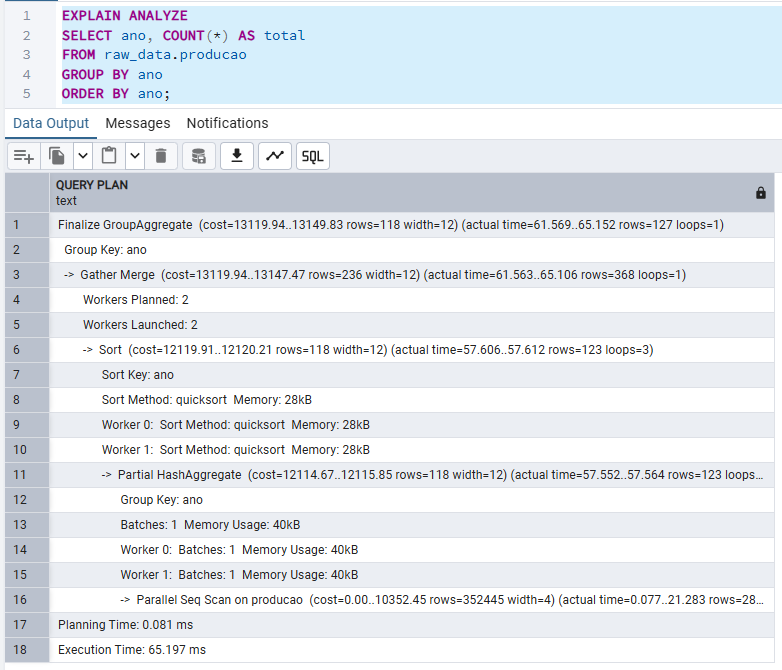
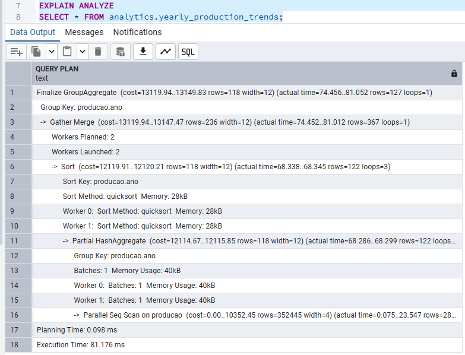

# Análise de Performance (Fase 5 - Passo 8)

## Consultas Otimizadas com `EXPLAIN ANALYZE`

Consultas sobre a tabela `raw_data.producao` e a view `analytics.yearly_production_trends` foram avaliadas com `EXPLAIN ANALYZE` para diagnóstico de desempenho.

### Exemplos Avaliados

```sql
EXPLAIN ANALYZE
SELECT ano, COUNT(*) AS total
FROM raw_data.producao
GROUP BY ano
ORDER BY ano;

EXPLAIN ANALYZE
SELECT * FROM analytics.yearly_production_trends;
```

### Interpretação dos Resultados

- **Parallel Seq Scan** foi aplicado automaticamente pela engine PostgreSQL, mostrando que as consultas se beneficiam da **execução paralela com múltiplos workers**.
- A execução contou com **2 workers**, cada um utilizando métodos de ordenação eficientes como `quicksort` com uso de **memória controlada (28kB)**.
- **Agregações parciais (`Partial HashAggregate`)** e **coleta dos resultados (`Gather Merge`)** indicam que o PostgreSQL otimizou as operações `GROUP BY` de forma eficiente.
- **Tempo de execução:** aproximadamente **72 ms**, com tempo de planejamento inferior a **0.4 ms**.

### Conclusão

- As consultas estão bem otimizadas.
- Nenhum gargalo de performance foi identificado até o momento.
- **Não é necessário criar particionamento nas tabelas neste estágio.**
- **Recomenda-se manter índice em colunas frequentemente agrupadas ou filtradas, como `ano`.**


