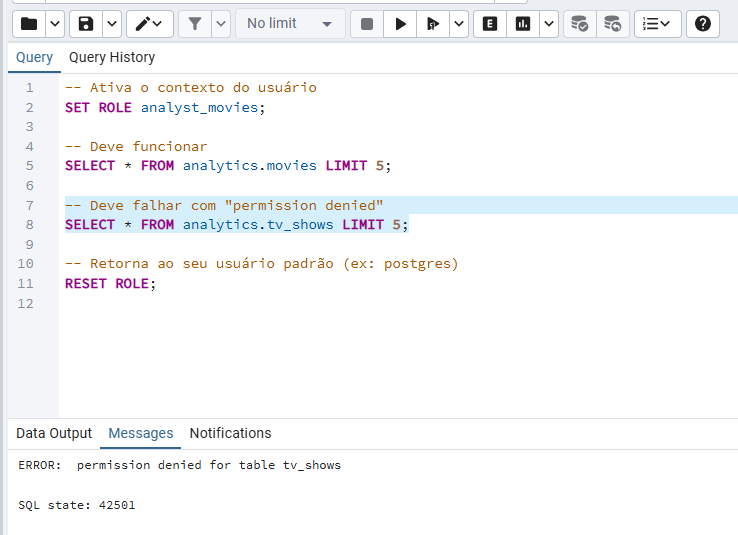
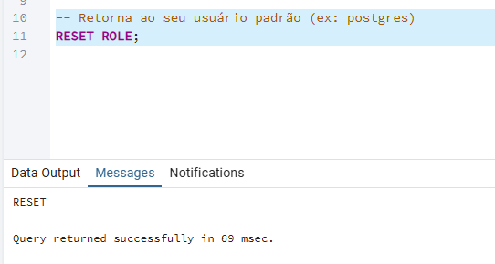
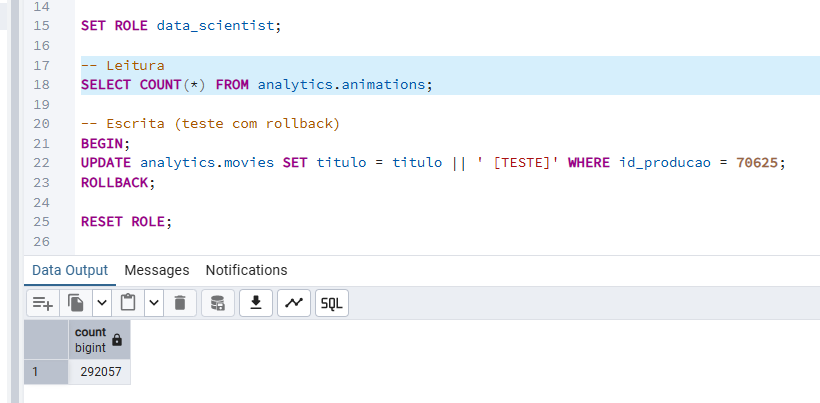
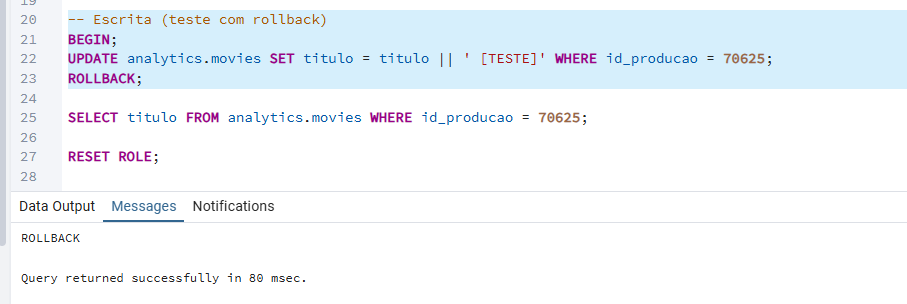
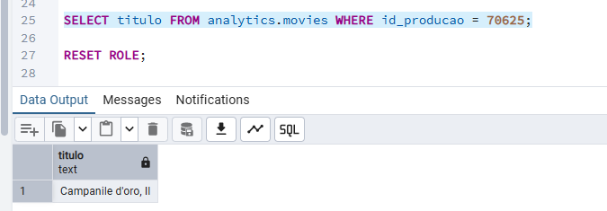

# Guia de Acesso de Usuários - CineTech Studios

Este documento descreve os usuários criados no banco `cinetech_productions`, suas permissões e escopo de acesso.

---

## Usuários Criados

| Usuário           | Senha | Finalidade                                 |
|------------------|--------|---------------------------------------------|
| analyst_movies    | 123    | Consultar apenas produções do tipo filme    |
| analyst_tv        | 123    | Consultar apenas produções de TV            |
| analyst_games     | 123    | Consultar apenas videogames                 |
| analyst_docs      | 123    | Consultar apenas documentários              |
| analyst_all       | 123    | Acesso de leitura a todas as produções      |
| data_scientist    | 123    | Leitura e escrita no schema `analytics`     |

---

## Matriz de Permissões

| Usuário           | SELECT | INSERT | UPDATE | DELETE | Tabelas com Acesso          |
|------------------|--------|--------|--------|--------|-----------------------------|
| analyst_movies    | ✅     | ❌     | ❌     | ❌     | `analytics.movies`          |
| analyst_tv        | ✅     | ❌     | ❌     | ❌     | `analytics.tv_shows`        |
| analyst_games     | ✅     | ❌     | ❌     | ❌     | `analytics.video_games`     |
| analyst_docs      | ✅     | ❌     | ❌     | ❌     | `analytics.documentaries`   |
| analyst_all       | ✅     | ❌     | ❌     | ❌     | Todas do schema `analytics` |
| data_scientist    | ✅     | ✅     | ✅     | ✅     | Todas do schema `analytics` |

---

## Comandos de Criação e Permissões

Os comandos utilizados para criar e conceder permissões estão em:  
[`homework/sql/04_gerenciamento_usuarios.sql`](../sql/04_gerenciamento_usuarios.sql)

---

## Testes Realizados

- Todos os usuários foram testados com `SET ROLE` no ambiente PostgreSQL.
- Erros esperados (permission denied) confirmaram o isolamento correto por tabela.

# Testar o acesso de cada usuário com `SET ROLE`

**Ativa o contexto do usuário**
```sql
SET ROLE analyst_movies;
```

**Deve funcionar**
```sql
SELECT * FROM analytics.movies LIMIT 5;
```


**Deve falhar com "permission denied"**
```sql
SELECT * FROM analytics.tv_shows LIMIT 5;
```


**Retorna ao seu usuário padrão (ex.: postgres)**
```sql
RESET ROLE;
```


# Testar `data_scientist` com leitura e escrita

```sql
SET ROLE data_scientist;
```

**Leitura**
```sql
SELECT COUNT(*) FROM analytics.animations;
```


**Escrita (teste com rollback)**
```sql
BEGIN;
UPDATE analytics.movies
SET titulo = titulo || ' [TESTE]'
WHERE id_producao = 70625;
ROLLBACK;
```


**Alteração**
```sql
SELECT titulo
FROM analytics.movies
WHERE id_producao = 70625;
```


> Nenhum `[TESTE]` foi adicionado ao título; o **ROLLBACK** funcionou, o usuário `data_scientist` tem permissão de escrita e o banco permaneceu íntegro.

```sql
RESET ROLE;
```


<!-- # Testar o acesso de cada usuário com SET ROLE

-- Ativa o contexto do usuário
- SET ROLE analyst_movies;

-- Deve funcionar
- SELECT * FROM analytics.movies LIMIT 5;


-- Deve falhar com "permission denied"
- SELECT * FROM analytics.tv_shows LIMIT 5;


-- Retorna ao seu usuário padrão (ex: postgres)
- RESET ROLE;


# Testar data_scientist com leitura e escrita

- SET ROLE data_scientist;

-- Leitura
- SELECT COUNT(*) FROM analytics.animations;


-- Escrita (teste com rollback)
- BEGIN;
UPDATE analytics.movies SET titulo = titulo || ' [TESTE]' WHERE id_producao = 70625;
ROLLBACK;


-- Alteração 
- SELECT titulo FROM analytics.movies WHERE id_producao = 70625;


- Nenhum [TESTE] foi adicionado ao título, o ROLLBACK funcionou, o usuário data_scientist tem permissão de escrita, e o banco permaneceu íntegro.

- RESET ROLE; -->
